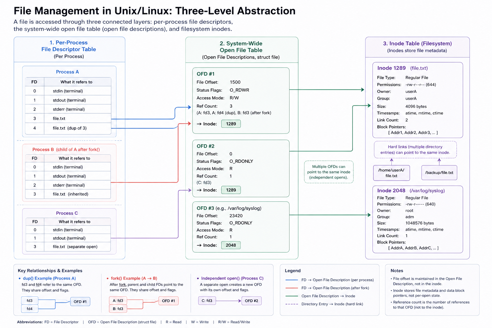

# Introduction

I’m pretty sure if you have been coding in C or any other low-level Programming Language you must have stumbled across the term `File Descriptors` , But what they heck are they? Let’s take a deep dive and find out.

## **What is a File Descriptor?**

In a Unix type system, a **File Descriptor** (FD in short) a small positive number used as reference to an open file in a process. In most Operating systems (especially Unix/Linux), **Everything is treated like a file.** Not just your “.txt” or “.cpp” files. So, according to OS :

- **Text file?** is a file.
- **Directory (folder)?** Also a file.
- **Keyboard input (stdin)?** File.
- **Display output (stdout)?** File.
- **Pipes? Network sockets? Devices?** All files.
- **Your Life? a file : )**

By default, each process systematically inherits three open file descriptors :

| **File Descriptor** | **Name**        | **`<unistd.h>`**    | **`<stdio.h>`** |
| ------------------- | --------------- | ------------------- | --------------- |
| **`0`**             | Standard Input  | **`STDIN_FILENO`**  | **`stdin`**     |
| **`1`**             | Standard Output | **`STDOUT_FILENO`** | **`stdout`**    |
| **`2`**             | Standard Error  | **`STDERR_FILENO`** | **`stderr`**    |

### But Why Do We Need File Descriptors?

The operating system needs to store much more than just a file's location. It needs to track where the file is, its permissions, its mode (read/write/append), the current read/write pointer position, and which process is using it. Using strings to handle all this information would be inefficient and complex. Instead, we use _fds_ - simple positive numbers that the a computer can process easily.

**The System’s Representation of Open Files**



1. **Per-process File Descriptor Table (Left-most column)**

Every process (like Process A, B, C) has it own personal table of file descriptors. Think of _fds_ like a list of shortcuts to files it’s currently using.

- Each entry in this table is just a small number (like 0, 1, 2… aka file descriptors).
- That number points to an entry in the shared Open File Table.
- Example: If Process A has fd = 4, it might point to “File B” in the share table.

```c
Process A             Process B
  ┌────┐                ┌────┐
  │ FD │                │ FD │
  └─┬──┘                └─┬──┘
    ↓                     ↓
┌──────────────┐   ┌──────────────┐
│Open File Tbl │   │Open File Tbl │
│- offset      │   │- offset      │
│- mode        │   │- mode        │
│- ref count   │   │- ref count   │
│- inode ptr   │   │- inode ptr   │
└────┬─────────┘   └────┬─────────┘
     ↓                  ↓
      ┌────────────────────────┐
      │      Inode Table       │
      │ - metadata (size, etc) │
      └────────────────────────┘
```

<aside>

Think of this like a browser having multiple tabs open — each tab number maps to a specific website, but different users can have tabs pointing to the same website.

</aside>

1. **Open File Table (Middle column in diagram)**

This is **shared by all processes**. It’s like a “what’s open right now” list.

Each entry includes:

- **Reference Count**: how many file descriptors (from any process) point here.
- **Access Mode**: like read-only, write, etc.
- **Offset**: where you are in the file while reading/writing.
- **Pointer to Inode**: it doesn’t store full file details, just points to where the actual info is (in the inode).

<aside>

Think of it like a checkout counter at a library — it doesn’t store the books, just tracks what’s checked out, by who, and where they are in reading.

</aside>

> _inode stand for index node._

### **3. Inode Table (Right-most column)**

This is where the **real metadata** about the file lives — and it’s also shared across the system.

Each inode entry has:

- **File path** (like /home/user/data.txt)
- **Size of the file**
- **Permissions**
- Possibly other stuff like timestamps, owner, etc.

<aside>

Basically, this is the file’s “identity card” in the OS. One inode per file.

</aside>

### **Mental Model — 3 Tables**

| **Layer**           | **Owned By**         | **What it stores**                                      |
| ------------------- | -------------------- | ------------------------------------------------------- |
| **FD Table**        | Per-process          | Just indexes (like 0, 1, 2) → point to Open File Table  |
| **Open File Table** | Shared across system | Stores offset, access mode, ref count, pointer to inode |
| **Inode Table**     | Kernel-managed       | Stores actual file metadata (path, size, perms, etc)    |

---

### **How Everything Works Together (Real Example)**

Let’s say **Process A** and **Process B** both want to read the same file: /tmp/log.txt.

Here’s how it plays out step-by-step:

---

**1. Each process gets its own File Descriptor (FD)**

- Example: Process A gets fd = 4, Process B gets fd = 3
- These are stored in each process’s own FD table
- Each FD points to a shared Open File Table entry

---

**2. Both FDs point to the same Open File Table entry**

- This is like a shared “file session”
- This Open File Table entry contains:
  - **Access mode** (e.g. read-only, write-only)
  - **Offset** (current read/write position)
  - **Reference count** (number of FDs pointing here)
  - **Pointer to the file’s inode**

Offset quick example:

> If you read 100 bytes, the offset moves forward — next read picks up where the last one ended.

---

**3. That entry then points to the inode**

- The inode holds the actual metadata of the file:
  - File path (/tmp/log.txt)
  - Permissions
  - Size
  - Owner, timestamps, etc.
- This inode is shared across the system

---

### **Inherited FDs via**

### **fork()**

When a process creates a **child using fork()**, the child process gets a **copy of the parent’s FD table**.

This means:

- Same file descriptors in both processes
- **Point to the same Open File Table entries**
- So they **share access mode and offset**

> Example: if parent is mid-way reading a file, the child picks up from that same point unless it duplicates or reopens the file.

---

### **Duplicating FDs with dup()/dup2()**

Sometimes you want **multiple FDs** pointing to the same file in the same process.

That’s what dup() and dup2() do:

```
int new_fd = dup(old_fd);   // duplicates old_fd
```

- Both FDs now refer to the same Open File Table entry
- **Same offset**, same file, same access mode
- Used for redirecting stdout, logging, etc.

---

### **Max FDs per process (`ulimit -n`)**

Every process can only open a limited number of FD’s at once.

This limit can be seen with:

```
ulimit -n
```

Typical default: 1024 (It was 256 on my MacBook)

If you hit this limit, you’ll get weird “too many open files” errors.

Solutions:

- Close unused FDs
- Increase the limit via ulimit or system config

---

### **Concurrency & File Locking**

If **multiple processes** are reading and writing the same file — things can get messy fast.

- Data might overlap or get corrupted
- Especially bad when they share offset (via fork() or dup())

Solution: **file locking**

Use tools like:

```
flock(fd, LOCK_EX);
```

This ensures only one process can write at a time.

---

### **Important Behavior**

- If both processes **share the same Open File Table entry**:
  - They share the **offset** and **access mode**
  - So if **A reads 100 bytes**, then **B will start reading from byte 101**
- If they **open the file separately**, then:
  - Each gets their own Open File Table entry
  - Offsets and access modes are **independent**
  - Both still point to the **same inode** (since it’s the same file)

---

### **When One Process Closes the File**

1. The FD is removed from that process’s FD table
2. The Open File Table’s **reference count is decremented**
3. If the ref count hits 0:
   - The Open File Table entry is deleted
4. The **inode** stays as long as:
   - The file still exists on disk **or**
   - Some other process still has it open

> Reminder: “File” here doesn’t only mean a text file — it can be a pipe, socket, terminal, etc : )

---

**TL;DR**

- **FD Table = Process-local handle**
- **Open File Table = Shared session info**
- **Inode = Permanent file identity**

> If your process is **opening, reading, writing, or waiting on some external thing**, there’s an FD involved.
>
> - File reads/writes
> - Network sockets
> - Pipes
> - Devices (like /dev/null)
> - Terminals

---

# FAQs

- Per-Process table stores FD’s of Parent or Child Process?
  Ans, per-process table can contain Both Parent and Child (Grand Child and so on) processes. When a child process is created it inherits the Fds of parent by default. Also two child process can point at same file but still will share same Access-mode and offset.
- What is Offset?
  It’s the **current position** in the file for read/write.
  Example:

  - You open a file.
  - Start reading — offset starts at 0.
  - You read 100 bytes — offset becomes 100.
  - Next read will begin from byte 100.
    It’s just a number internally, looks like:

  ```c
  off_t offset = 100; // means 100 bytes from start
  ```

  Each Open File Table entry has it’s own offset.

- What if One process wants to read and another wants to write the same file?
  Happens all the time.
  Each process:

  - Opens the file with its **own access mode** (read, write, read+write, etc).
  - Gets its own file descriptor.
  - But both can point to the **same open file entry**, or get separate ones depending on how they open it.
    If they **share the same Open File Table entry**, they share the same offset and mode.
    If they open it separately, they each get **independent access mode + offset**.
    So:

  - **Shared FD** → Shared mode/offset.
  - **Separate FD** → Independent mode/offset.
    OS handles synchronisation issues like file locks if needed.

- Inode table stores metadata about
  **Files. Only files.**
  Each file on disk has one inode.
  Inode holds:

  - Path
  - Permissions
  - Owner
  - Size
  - Timestamps
  - etc.
    **Processes are not stored in the inode table.**
    /proc/<pid> is a **virtual file**, not a real file on disk.
    > Virtual File : Files which are created in ram by the kernel when the user (OS) asks for it. For example files containing info about CPU and GPU temperature.
